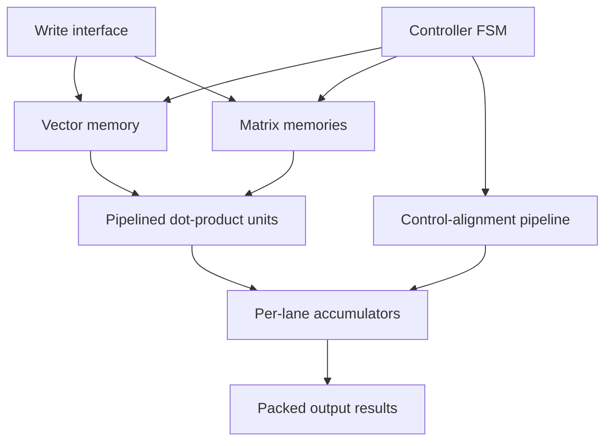

# SystemVerilog Matrix-Vector Multiplication Accelerator

A parameterized RTL accelerator that performs matrix-vector multiplication using parallel output lanes. This project was completed with a partner for ECE 327: Digital Hardware Systems at the University of Waterloo.

## Architecture and Data Flow

The default configuration processes eight signed 8-bit elements per memory word and computes eight output rows in parallel.

1. The input interface loads the vector into one vector memory and distributes matrix rows across one matrix memory per output lane.
2. The controller generates synchronized vector and matrix read addresses.
3. Each memory word contains eight signed elements. The vector word is broadcast to every output lane, while each lane reads a different matrix word.
4. Each `dot8` unit multiplies eight element pairs and reduces the products through a pipelined adder tree.
5. Each accumulator combines successive partial dot products until an entire matrix row has been processed.
6. The completed lane results are concatenated into `o_result` and marked valid through `o_valid`.

The synchronous memories introduce one cycle of latency, while the dot-product pipeline introduces five cycles. The top-level module delays the associated valid, first, and last control signals so that they remain aligned with the corresponding data.

## Controller and Accumulator Behaviour

### Controller

The controller is a two-state finite-state machine:

* **IDLE:** Deasserts `busy` and the compute-valid signal while capturing the operation parameters.
* **COMPUTE:** Iterates through the packed vector words and corresponding matrix-memory addresses.

For every matrix row:

* `vec_raddr` traverses the vector and restarts at the beginning for the next row.
* `mat_raddr` advances through consecutive matrix words.
* `accum_first` identifies the first partial dot product of a row.
* `accum_last` identifies the final partial dot product of a row.
* `busy` remains asserted while the operation is active.

After all assigned rows have been processed, the controller returns to `IDLE`.

### Accumulator

Each output lane contains a signed accumulator.

* When `ivalid` is low, the running sum is preserved.
* When `first` is asserted, the incoming dot product starts a new accumulation.
* On later valid cycles, the incoming value is added to the running sum.
* When `last` is asserted, `ovalid` indicates that the completed row result is available.

## Simulation

The complete design can be simulated using AMD Vivado.

1. Clone this repository.
2. Open Vivado and create a new RTL project.
3. Add every `.sv` file under `src/` as a **Design Source**.
4. Add `tb/mvm_tb.sv` as a **Simulation Source**.
5. Set `mvm_tb` as the simulation top module.
6. Select **Run Simulation → Run Behavioral Simulation**.
7. Select **Run All** in the simulator.

The supplied testbench generates a random matrix and vector, computes reference results, and compares those results against the RTL output. The final console message reports either `TEST PASSED!` or `TEST FAILED!`.

The integration testbench was provided with the course materials and was not authored by Joseph Choi.

## Contributions

This was a partnered project. Public repository ownership does not imply sole authorship of the complete design.

| Component   | Primary source  | Joseph Choi’s contribution                                                                              |
| ----------- | --------------- | ------------------------------------------------------------------------------------------------------- |
| `ctrl.sv`   | Joseph Choi     | Implemented the controller FSM, address generation, operation tracking, and accumulator-control signals |
| `accum.sv`  | Joseph Choi     | Implemented the signed running accumulator and final-result signalling                                  |
| `mvm.sv`    | Partnered work  | Helped integrate memories, dot-product units, accumulators, and top-level control/data alignment        |
| `dot8.sv`   | Project partner | Not implemented by Joseph                                                                               |
| `mem.sv`    | Course-provided | Included as supporting infrastructure; not authored by Joseph                                           |
| `mvm_tb.sv` | Course-provided | Included for reproducibility; not authored by Joseph                                                    |
